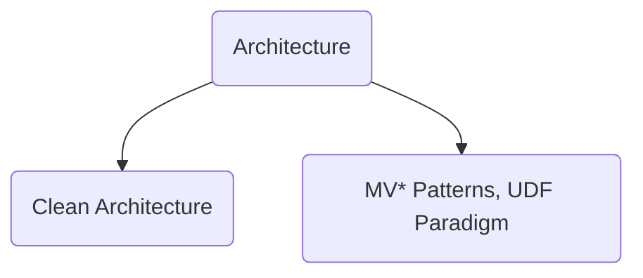
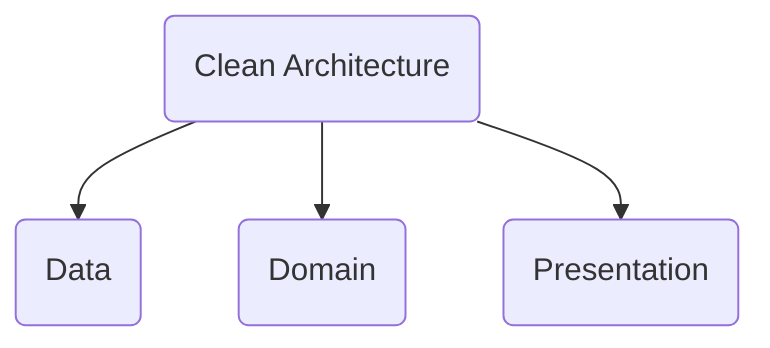
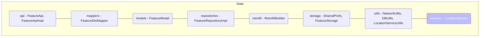
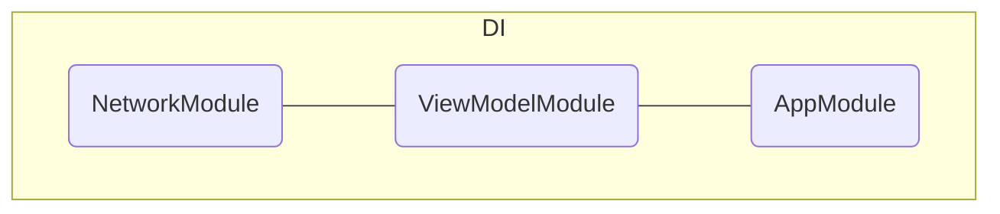
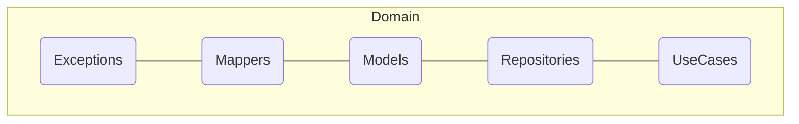

Когда говорим об архитектуре в андроид приложении, важно разделять понятие Чистой архитектуры и архитектурного паттерна слоя представления.

#### Architecture



- Под Чистой архитектурой в андроид приложении обычно подразумевают разделение на слои: `data`, `domain`, `presentation`.
- Примерами паттернов слоя presentation могут быть `MVP`, `MVVM`, `MVI` и тд.

Ниже я приведу примеры того, что может лежать в каждом слое. Не всё из этого может присутствовать в приложении одновременно, может быть что-то ещё сверху, также могут быть вариации того, что в каком слое присутствует.

#### Clean Architecture



**data**
> слой данных

**domain**
> слой бизнес-логики (прослойка между слоем данных и слоем представления, не должен содержать зависимостей от других слоёв)

**presentation**
> слой представления

**di** (dependency injection)
> слой внедрения зависимостей (или инициализации объектов, используемых далее по всему приложению). Может быть в составе другого модуля, может быть вынесен в отдельный модуль, как здесь.

---

#### Data Layer



- `data`
  - `api`
    > тут перечисляются endpoints
  например, get-запрос человека из списка людей по id:

    ```
    @GET("your_server/v1/people/{id}")
    fun getPersonById(
        @Path("id") id: String,
    )
    ```
  - `mappers`
    > маппинг из моделей, приходящих с бека, в модели domain слоя, более удобные для использования в приложении
  - `models`
    > классы данных, какими они приходят с бека (по сути разбитый на классы json запрос). Полезный плагин [JsonToKotlinClass](https://plugins.jetbrains.com/plugin/9960-json-to-kotlin-class-jsontokotlinclass-)
  - `repositories`
    > этот пакет отведён под реализацию паттерна Repository
  - `retrofit`
    > здесь задаётся билдер библиотеки [retrofit](https://github.com/square/retrofit), с помощью которой в андроид ходят в интернет (обычно в связке с OkHttp)
  - `storage`
  - `utils`

#### DI Layer



- `di`
  - разные модули (AppModule, ViewModelModule, NetworkModule, etc.)

#### Domain Layer



- `domain`
  - `mappers`
    > маппер для моделей domain слоя (бывает, что нужно несколько моделей по сути одной и той же сущности, но для разных кейсов)
  - `models`
    > модели промежуточного слоя, более удобные для использования в приложении (например, здесь можно переименовать поля или обработать nullable поля, задав им дефолтные значения)
  - `interactors/usecases` (в этих классах содержится метод или наборы методов бизнес-логики - дёргаюся методы из Репозитория, прокидываются по слоям ниже или подготавливаются данные - освобождая место во вью модели)
  - `exceptions`
     > запрос в сеть может завершиться с ошибкой, про коды ошибок можно почитать [тут](https://developer.mozilla.org/en-US/docs/Web/HTTP/Status), про тела ошибок и саму обработку поговорим позже
  - `repositories`
     > интерфейсы методов, реализуемых в data слое в пакете repositories; этот пакет часто отсутствует

#### Presentation Layer

```mermaid
flowchart TD;

activities(Activities)
adapters(Adapters, ViewHolders, DiffUtils)
app(<YourProject>Applicaton)
components("Components (Composables)")
dialogs(Dialogs)
fragments(Fragments)
navigation(Navigation)
mappers(Mappers)
models(Models)
screens(Screens)
screenStates(ScreenStates)
views(Views)
viewModels(ViewModels, ViewModelFactories)
uicommon(UICommon)

subgraph Presentation
  activities --- adapters
  adapters --- app
  app --- components
  components --- dialogs
  dialogs --- fragments
  fragments --- navigation
  navigation --- mappers
  mappers --- models
  models --- screens
  screens --- screenStates
  screenStates --- views
  views --- viewModels
  viewModels --- uicommon
end

style components fill:#bbf,stroke:#f66,stroke-width:2px,color:#fff,stroke-dasharray: 5 5
style navigation fill:#bbf,stroke:#f66,stroke-width:2px,color:#fff,stroke-dasharray: 5 5
style uicommon fill:#bbf,stroke:#f66,stroke-width:2px,color:#fff,stroke-dasharray: 5 5
```



- presentation
  - `activities`
  - `adapters`
  - components/composables
  - `dialogs`
  - `fragments`
  - `mappers`
    > маппит модельки domain слоя в модельки слоя представления (например, с бека тащится какой-нибудь статус, а здесь его можно смаппить в строки/цвета, чтобы красиво отобразить)
  - `models`
    > модели данных, напрямую используемые в слое представлений (тут, например, enum поле StatusChecked может рассыпаться на поля statusColor, statusName, которые будут знать про ресурсы)
  - `navigation`
    > может быть отдельным модулем, но у этого есть свои минусы
  - `screens`
    > если jetpack compose присутствует, но и без него видела отдельный пакет для задания экранов
  - `views`
    > кастомные вьюшки
  - `viewmodels`
    > если у вас MVVM; ViewModelFactory тоже сюда обычно идёт
  - `screenstates`
    > если у вас MVVM с вкраплением идей MVI, где состояние экрана стараются держать в одном месте
  - `presenters`
    > если у вас MVP
  - `extensions`
    > для вьюх, листенеров и тд
  - `uicommon`
    > может быть отдельным модулем в многомодульном проекте; общие ui элементы, используемые во многих частых проекта

P.s. Зачем это всё нужно? Чтобы:
> - было легче ориентироваться в проекте
> - комфортнее работать над проектом в команде/вводить в проект нового человека
> - учиться лучшим практикам, потому что в любом production проекте разбиение по пакетам будет, и лучше к этому привыкать с самого начала

* Gist буду обновлять по мере роста собственного понимания/опыта и по мере возможности; можно заводить issue с вопросами по материалам, делать PR и тд.
